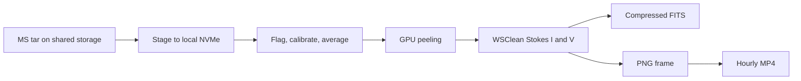

# GPU Subband Imaging

Distributed OVRO-LWA snapshot imaging across a small GPU cluster. One control
process schedules independent subband batches over SSH and records progress in
SQLite, so interrupted runs can resume.



CPU preprocessing, GPU peeling, and image archiving overlap within each batch.
A failed batch is logged and retried without stopping other subbands.

## Requirements

- Python 3.8+
- `python-casacore`, CASA tasks, NumPy, Astropy, and PyYAML
- WSClean, AOFlagger, CFITSIO `fpack`, and FFmpeg
- Julia, CUDA, and TTCalX
- Passwordless SSH from the control host to each worker
- Shared input, calibration, state, and output paths

Install the Python package in the prepared runtime environment:

```bash
python -m pip install -e .
export GSI_WORKER_SH="$PWD/workers/run_worker.sh"
```

## Configure

Copy `examples/config` to a local, untracked directory and edit all paths and
node names:

```bash
cp -R examples/config config-local
```

- `cluster.yaml`: nodes, GPUs, worker limits, state, and scratch paths
- `subbands.yaml`: image size and pixel scale by frequency
- `pipeline.yaml`: date, inputs, calibration, peeling, imaging, and movies

The default Lustre write guard only allows
`/lustre/pipeline/snapshots_gpu_pipeline`. Set
`GSI_ALLOWED_LUSTRE_WRITE_ROOT` before launch to use another Lustre output tree.

## Run

```bash
gsi dry-run --config "$PWD/config-local"
gsi run --config "$PWD/config-local"
gsi status --config "$PWD/config-local"
gsi resume --config "$PWD/config-local"
```

Products are written under:

```text
<output_root>/<band>MHz/<date>/<hour>/fits/*.fits.fz
<output_root>/<band>MHz/<date>/<hour>/<band>MHz_<date>_<hour>UTC.mp4
<output_root>/_metadata/<date>/run.json
```

Movie PNGs include the snapshot's UTC date/time and a `Jy/beam` color scale.
They live in the hour's `images/` directory and are removed after a successful
stitch when `movie.keep_frames` is `false`. The metadata JSON records the code
revision, frozen configuration, calibration paths, processing parameters, and
final ledger summary.

For unattended daily runs, see `scripts/run_daily_allsubbands.py`. Deployment
notes are in `deploy/README-deploy.md`; the scheduler design is in
`docs/DESIGN.md`.
